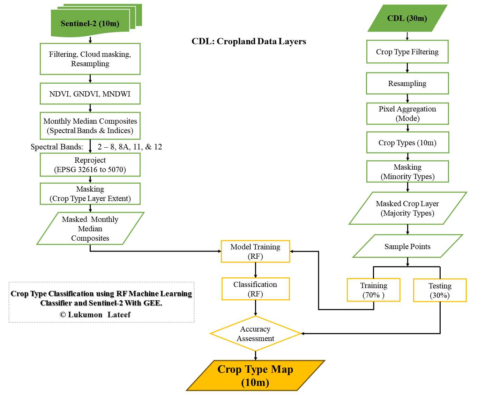
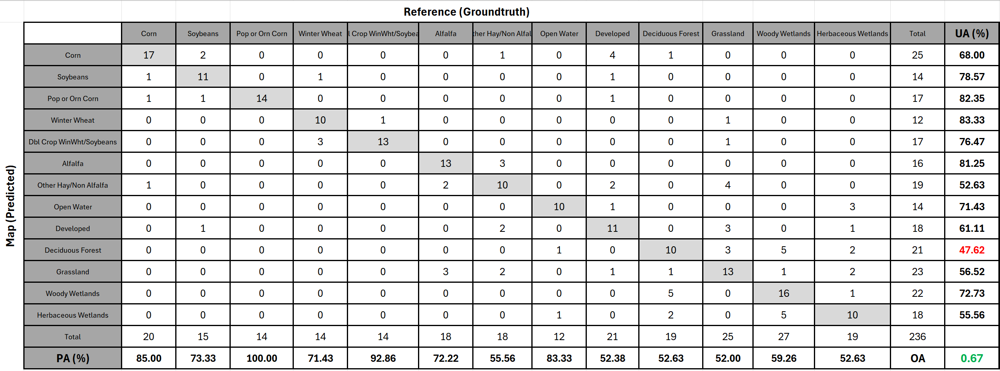
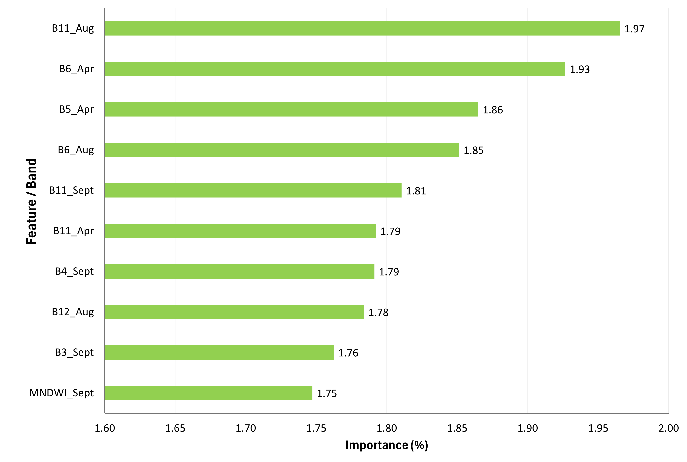

# Introduction
The project aimed to classify crop types using time-series Sentinel-2 images with Random Forest Algorithm in Google Earth Engine (GEE) with Python API. The study area is part of Van Wert, Ohio USA.

# Methodology
I used separate timeframes that capture different growing periods (phenological development) of the crops. The farming (planting, growing, and harvesting) season is between April - December [(USDA)](https://ipad.fas.usda.gov/rssiws/al/crop_calendar/us.aspx). So, I used monthly Sentinel-2 composites with spectral indices from May to October. I have 10 spectral bands and 3 spectral indices bands for each month's composites. Therefore, that was 13 features x 6 months = 78 total features. However, A significant number of pixels were masked out of the July composite image by the cloud mask function. So, I had to remove the July composite from the predictor bands. Training/testing samples were derived from the existing crop data layer (CDL) using the stratified random samping approach.

# Results

## Crop Type Map

## Error Matrix

## Feature Importance

# Findings / Conclusions

   * Knowledge/information about the planting seasons and/or crop calendar is crucial in image selection to capture crop phenology and achieve satisfactory results. 
 
   * Similarly, monthly image composites are better than just one image composite over the planting seasons/period.
 
   * Training/testing samples were derived from the existing crop data layer. This method has been found to be reliable, especially when there is no ground truth since it would be challenging to sample crop types precisely from Aerial/Satellite images without prior knowledge of the farm plots.
 
   * The SWIR Band (11) from the August composite image (during the peak of the major crops) is the most important band/feature. 
 
   * The SWIR bands (5 & 6) and red edge Bands (11 & 12) are the most important features in the classification. This is expected considering the classes are mostly vegetation/crops.
 
   * The result from Sentinel-2 is more detailed compared to the 30m CDL. An example is the buildings/developed land in Figure 2, which is more clearly distinguished from other classes in the 10 m classification map but generalized in the CDL 30m map.

# References

Google Earth Engine (2024-07-13). ee.Image.stratifiedSample. https://developers.google.com/earth-engine/apidocs/ee-image-stratifiedsample. Accessed: 18 July 2024.

Google Earth Engine (2023-10-06). ee.Classifier.smileRandomForest. https://developers.google.com/earth-engine/apidocs/ee-classifier-smilerandomforest. Accessed: 18 July 2024.

Tran, K. H., Zhang, H. K., McMaine, J. T., Zhang, X., & Luo, D. (2022). 10 m crop type mapping using Sentinel-2 reflectance and 30 m cropland data layer product. International Journal of Applied Earth Observation and Geoinformation, 107, 102692. https://doi.org/10.1016/j.jag.2022.102692

United States Department of Agriculture, International Production Assessment Division (IPAD). Monthly Crop Stage Calendars. https://ipad.fas.usda.gov/ogamaps/cropmapsandcalendars.aspx. Accessed: 03 AUgust 2024.

USDA National Agricultural Statistics Service Cropland Data Layer. {YEAR}. Published crop-specific data layer [Online]. Available at https://nassgeodata.gmu.edu/CropScape/ (accessed 13 July 2024). USDA-NASS, Washington, DC.

United States Department of Agriculture National Agricultural Statistics Service. Cropland Data Layers - FAQs. https://www.nass.usda.gov/Research_and_Science/Cropland/sarsfaqs2.php. Accessed: 15 July 2024.

Usual Planting and Harvesting Dates for U.S. Field Crops (December 1997). https://swat.tamu.edu/media/90113/crops-typicalplanting-harvestingdates-by-states.pdf. Accessed: 15 July 2024.

USDA's National Agricultural Statistics Service. 2023 Crop Progress and Conditions. https://www.nass.usda.gov/Charts_and_Maps/Crop_Progress_&_Condition/2023/index.php. Accessed: 03 AUgust 2024.

United States Department of Agriculture. Crop Calendars for United States. https://ipad.fas.usda.gov/rssiws/al/crop_calendar/us.aspx. Accessed: 15 July 2024.